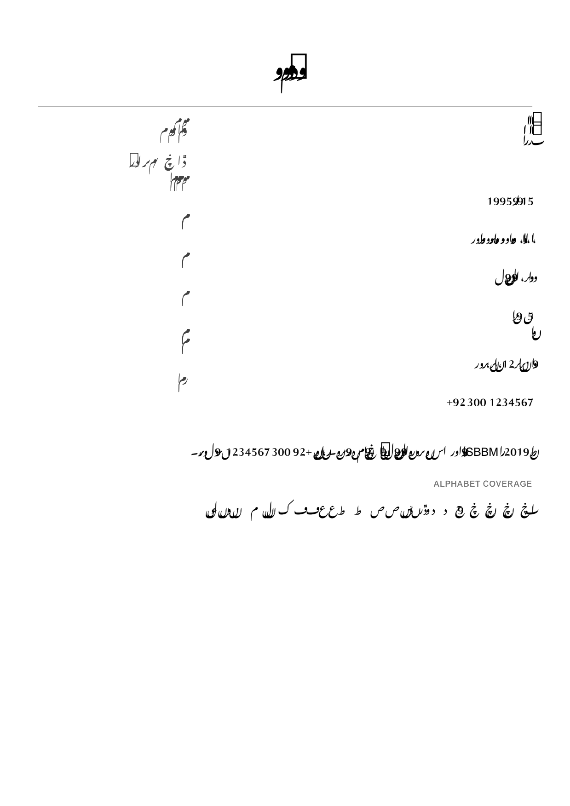
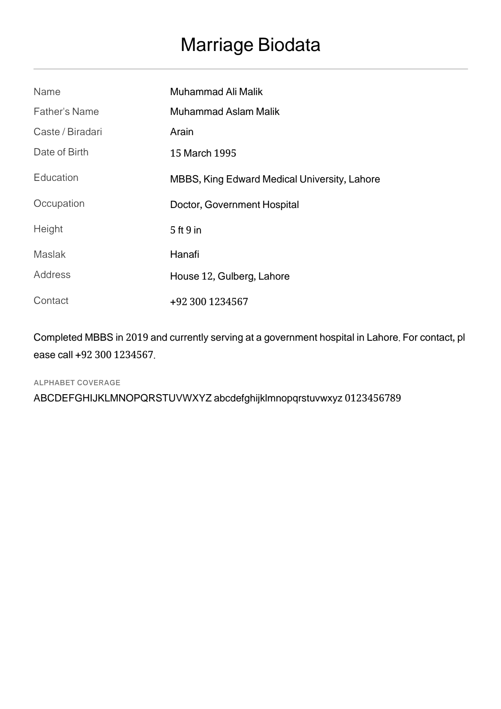
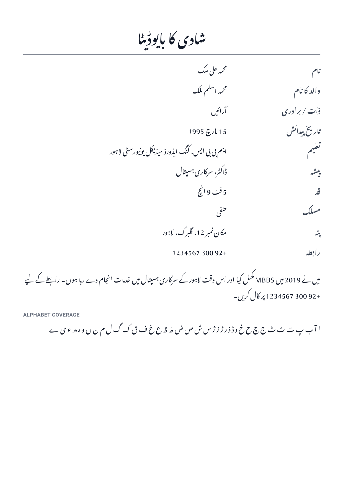
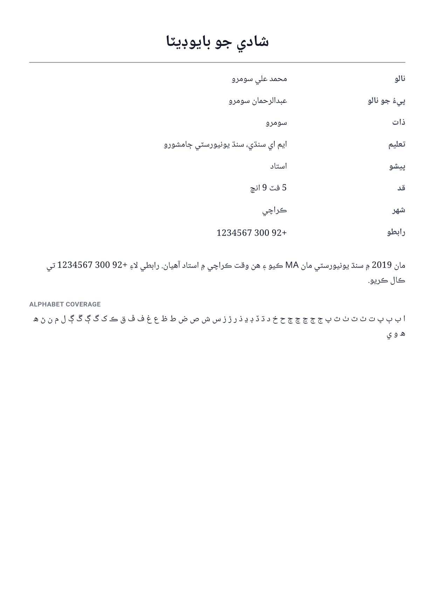
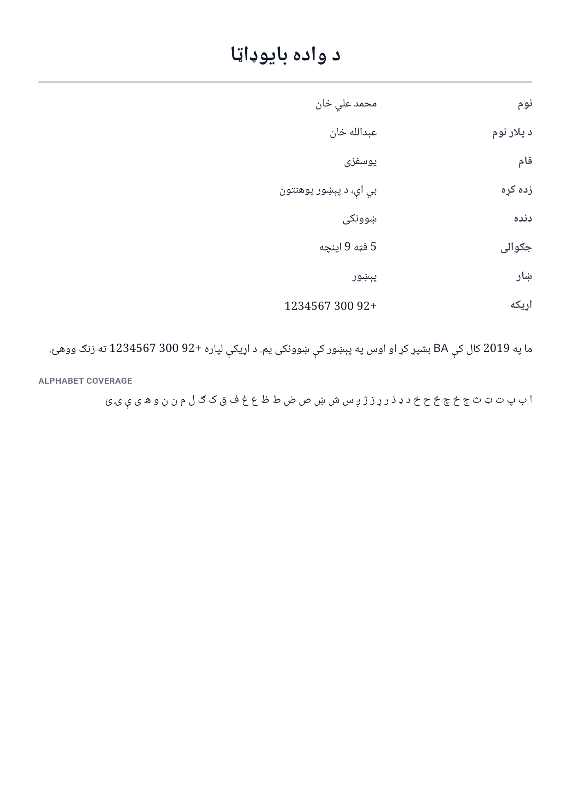
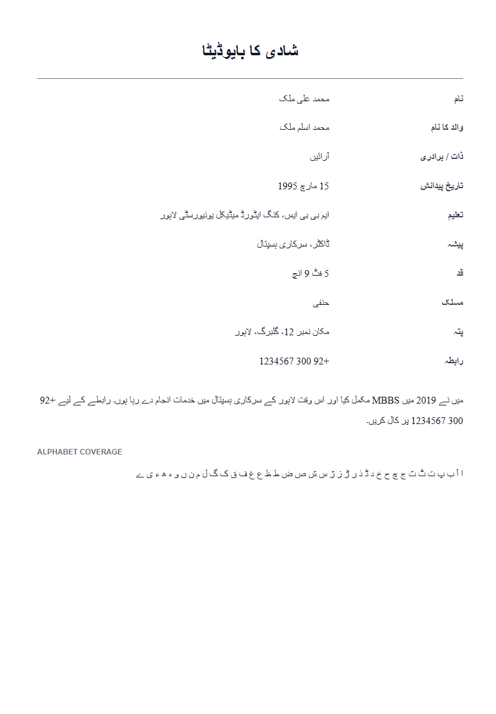

# M0 — Nastaliq PDF spike report

**Status:** complete, pending your approval of the pipeline choice.
**Date:** 2026-08-04
**Spike code:** `spike/nastaliq_spike/` (throwaway — see "What to delete" at the end)
**Raw outputs:** `spike/artifacts/out/` (22 files: PDF + 150dpi PNG per pipeline × language, plus `report.json`, `spike-log.txt`)

---

## TL;DR

**Pipeline B (widget rasterization) wins, and it isn't close.** Pipeline A is not "poor" as the build prompt predicted — it is categorically unusable for every Perso-Arabic script. Pipeline C's *typography* is genuinely good and it does emit real vector text, but the `printing` package's Android path to it is deprecated **and** broken, so it is not shippable in Phase 1.

**Recommendation:** ship the hybrid.

| Document language | Pipeline | Why |
|---|---|---|
| Urdu, Sindhi, Pashto, Punjabi, and all other Perso-Arabic | **B — raster** | The only pipeline that produces correct output today |
| English (and Roman Urdu, Latin script) | **A — vector** | Correct, 20× smaller, 60× faster, selectable/searchable text |

Two things block a clean "all criteria pass" and both need you:
1. **No native-reader review has happened.** My own inspection of every output is recorded below, and Urdu/Sindhi/Pashto all look correct to me — but the build prompt makes a native reader the gate, and I am not one.
2. **The < 3 s budget is unproven on real hardware.** I have no low-end device and no API 26 image; all timings below are from a Pixel 10 Pro emulator on this desktop, which is *faster* than the target phone, not slower.

---

## What was built

A throwaway Flutter app that renders the same biodata-shaped document — heading, ten label/value rows, a mixed-direction paragraph, and a full-alphabet coverage strip — through all three pipelines in Urdu, Sindhi, Pashto, and English (control). It uses one shared layout spec (`lib/spec.dart`: A4, 40 pt margins, 22 pt heading, 12 pt body, Nastaliq line-height 2.1, Naskh 1.7, Latin 1.4) so the only variable is the rendering technology.

The content is deliberately real rather than lorem ipsum: `MBBS`, `2019`, `+92 300 1234567`, `15 مارچ 1995` and each language's complete alphabet, because that is where these pipelines break.

Fonts: **Noto Nastaliq Urdu** and **Noto Naskh Arabic**, both SIL OFL, downloaded from the upstream `notofonts` release build. License text is at `spike/nastaliq_spike/assets/fonts/OFL.txt`.

Run on: Pixel 10 Pro emulator, Android API 36, **profile mode** (debug-mode Dart timings would be meaningless). Flutter 3.44.0 / Dart 3.12.0, `pdf` 3.13.0, `printing` 5.15.0.

---

## Pipeline A — reshaper + embedded font, vector text

**Verdict: total failure on Perso-Arabic. Do not ship for any RTL language.**

This is not a tuning problem. Reading the output against the input:

| Input | Rendered as |
|---|---|
| `شادی کا بایوڈیٹا` (heading) | four disjointed glyph clusters and a `.notdef` tofu box |
| `نام`, `تعلیم`, `پیشہ` … (labels) | collapsed to one or two orphaned glyphs each |
| `MBBS` | `SBBM` |
| `15 مارچ 1995` | `19959915` |
| `محمد علی ملک` | unreadable glyph pile |

Three independent failure modes are stacked here:

1. **The presentation-forms model cannot express Nastaliq.** U+FB50–FDFF encodes initial/medial/final/isolated forms — a Naskh-era approximation. Nastaliq's vertical letter-stacking and contextual ligatures live in the font's GSUB table, which the `pdf` package never executes.
2. **Coverage holes produce tofu**, visible in the heading, because extended Urdu/Sindhi/Pashto letters have no presentation-form codepoints.
3. **Latin and digit runs get reversed**, because `pdf` splits the string on whitespace and lays the words out right-to-left (`lib/src/widgets/text.dart:956-965`).

Swapping the built-in shaper for the standalone `arabic_reshaper` package would not help — the built-in path *is* the same algorithm (`arabic.convert()`, called automatically for RTL text), and failures 2 and 3 sit outside the reshaper entirely.

**Pipeline A on Latin, though, is excellent** — and this is what makes the hybrid worth doing:

Correct, crisp, selectable, searchable, 12 KB, 26 ms. One cosmetic defect: the `pdf` package breaks lines mid-word (`ple / ase`) rather than at word boundaries, which needs a manual wrap pass before an English template ships.

---

## Pipeline B — widget rasterization

**Verdict: correct on every script tested. This is the pipeline.**

Urdu Nastaliq is properly joined, properly stacked, with no collisions between descenders and the line below — the 2.1 line-height multiplier from the build prompt is right; 1.4 would have collided. `MBBS` and `2019` sit correctly inside the Urdu sentence. The full 41-letter alphabet strip renders with zero tofu.

Sindhi (Naskh) — all extended letters present, `ٻ ڀ ٿ ٽ ٺ ڄ ڃ ڇ ڌ ڏ ڊ ڍ ڙ ڦ ڪ ڳ ڱ ڻ` included, no tofu:

Pashto (Naskh) — `ټ ځ څ ډ ړ ږ ښ ڼ ګ ې ۍ ئ` all present, no tofu:

Capture is **2482 × 3512 px**, i.e. A4 at 300 dpi, from a `RepaintBoundary` laid out at true 595 × 842 pt.

> **Harness note worth keeping.** My first capture attempt was silently wrong: I wrapped the boundary in `Transform.scale` inside a small `SizedBox`, and `SizedBox` *enforces* incoming constraints, so the page laid out at 190 × 269 pt and was then upscaled to A4 — producing a blurry, half-empty page that looked like a rendering bug. The fix is `FittedBox` (which passes unbounded constraints to its child) plus an explicit assertion that the boundary's size equals the page size. **The real app must keep that assertion**, because this failure is invisible in code review and only shows up in the exported artifact.

---

## Pipeline C — HTML → PDF via the Android WebView

**Verdict: the typography is good and the vector-text promise is real. The tooling is not shippable in Phase 1.**

`Printing.convertHtml` **never completed** — all four languages timed out. Three separate problems, all in `printing` 5.15.0:

1. **It is deprecated.** `Printing.convertHtml` carries `@Deprecated('Please use another method to create your PDF document')` (`printing-5.15.0/lib/src/printing.dart:221`). Building the core of the product on a deprecated API is a bad trade.
2. **The Android plugin never reports the capability.** `PrintingJob.printingInfo()` returns `directPrint`, `dynamicLayout`, `canPrint`, `canShare`, `canRaster` — and no `canConvertHtml` key at all, so the Dart side defaults it to `false`. Our run logged `printing caps: raster=true html=false`.
3. **The implementation has a race that hangs the future.** `PrintingJob.convertHtml()` calls `webView.loadDataWithBaseURL(...)` and only *then* calls `webView.setWebViewClient(...)` (`PrintingJob.java:365-378`). The completion signal is `onPageFinished` on that client, so when the load wins the race, the callback never fires and the Dart future never completes — which is exactly the hang observed, rather than a clean error.

To avoid rejecting C on tooling grounds without ever seeing its output, I rendered the identical HTML through Blink directly (headless Chrome, `--print-to-pdf`):

Shaping is correct — joined, stacked, no tofu — and the resulting PDF contains **three embedded `CIDFontType2` fonts with `FontFile2` streams**, confirming genuine vector text rather than a rasterized fallback. So the concept works; only the road to it is closed.

**Caveat:** this used desktop Chrome, not Android WebView, so it does *not* test the API-26-vs-current WebView variance the build prompt flags. If we ever revisit C, that test still has to happen.

---

## Numbers

Median of 3 runs, Pixel 10 Pro emulator, profile mode. Every output was a single A4 page.

| Language | A — time | A — size | B — time | B — size | C |
|---|---|---|---|---|---|
| Urdu | 77 ms | 16 KB | 3905 ms | 250 KB | timeout |
| Sindhi | 26 ms | 24 KB | 2057 ms | 187 KB | timeout |
| Pashto | 24 ms | 22 KB | 2339 ms | 173 KB | timeout |
| English | 26 ms | 12 KB | 2470 ms | 241 KB | timeout |

Those B numbers are **cold** — first render of each page, which is precisely what the user experiences on their first export. Warm, the same work is much cheaper. Resolution sweep (Urdu, best of 2, warm):

| Capture DPI | Pixels | Time | PDF size |
|---|---|---|---|
| 150 | 1240 × 1755 | 327 ms | 105 KB |
| 200 | 1653 × 2339 | 602 ms | 149 KB |
| 250 | 2066 × 2924 | 972 ms | 192 KB |
| 300 | 2480 × 3509 | 1319 ms | 251 KB |

Cost is essentially linear in pixel count, and it is dominated by PNG encoding, not by GPU rasterization.

**What this means for NFR-2.** Warm 300 dpi at 1.3 s is comfortable; cold at 2.5–3.9 s already brushes the 3 s ceiling *on hardware faster than the target*. A 3 GB budget phone will be slower, plausibly by 2–4×. Concrete mitigations, in the order I'd apply them:

1. **Encode JPEG, not PNG.** PNG is the whole cost here and is the wrong format for a mostly-text page we are already rasterizing. `flutter_image_compress` does this natively (fast); the pure-Dart `image` package does not (slow). This also directly serves 9.1's WhatsApp export.
2. **Default to 200 dpi, offer 300 dpi as a "high quality print" toggle.** 200 dpi is visually fine on screen and acceptable at a corner print shop; it costs less than half.
3. **Warm the render** while the user is on the Preview screen, so the export tap hits a warm path.
4. Only then consider caching or background isolates.

**File-size note for 9.1:** the WhatsApp-tuned capture (1600 px long edge) is 121 KB as PNG and fully legible for Urdu — see `docs/spike-assets/B_ur_whatsapp.png`. As JPEG q90 it will be far smaller. The target range in the build prompt is sound.

---

## The one real rendering bug found — and it affects all pipelines

`+92 300 1234567` renders as **`1234567 300 92+`** in Urdu, Sindhi, and Pashto — in Pipeline B *and* in Blink. That is not a Flutter bug; it is correct Unicode bidi behaviour. In an RTL paragraph the spaces are neutral and take the paragraph direction, so the three digit groups are ordered right-to-left.

It is also exactly the failure the build prompt's exit criteria call out, and it will look wrong to every user.

**Fix, for M2/M3:** wrap the value of any phone/number/email/URL field in isolate marks — `U+2066 LRI` … `U+2069 PDI` — or give those field types an explicit LTR direction in the renderer. This belongs in the field engine as a property of `FieldType`, not as a per-template patch, so it applies everywhere including custom fields. `MBBS` and `2019` inside prose are unaffected and render correctly.

One item I could not fully resolve at this resolution: Sindhi `۾` (U+06FE) may be falling back rather than rendering from Noto Naskh Arabic. It is not tofu, but it wants a check under the glyph-coverage test in M3.

---

## Exit criteria

| Criterion | Status |
|---|---|
| Output reviewed by a native Urdu reader, and ideally Sindhi + Pashto readers | **Outstanding — needs you.** My own reading of all four outputs is above; A fails, B and C-via-Blink look correct to me. This gate is yours to close. |
| Mixed-direction text doesn't scramble (`MBBS`, `2019`, `+92 300 1234567`) | **Partial.** `MBBS`/`2019` pass in B. Phone numbers fail in every pipeline; root cause identified and fix specified above. |
| A4 export sharp at 300 dpi-equivalent | **Pass structurally** — 2482 × 3512 px, verified. Not physically printed. |
| Generation < 3 s on a low-end reference device | **Unproven.** No 3 GB device and no API 26 image available here. Emulator numbers and the full resolution/time curve are above; a real-device run is required before M3 closes. |
| Report file size per pipeline | **Pass** — table above. |

---

## Fallback plan

If a native reader rejects Pipeline B's Nastaliq, in order:

1. **Change the font, not the pipeline.** Noto Nastaliq Urdu is the conservative OFL choice; if reviewers find it too tight or too "Google", evaluate other OFL Nastaliq faces (e.g. Gulzar) before touching the architecture. Rendering is correct; taste is separable.
2. **Tune line-height and size per script.** These are one-line changes in the layout spec.
3. **Revisit Pipeline C** by vendoring a corrected `convertHtml` — the plugin bug is a two-line ordering fix and we would carry a patched copy. Only worth it if selectable text becomes a hard requirement, and it still needs the WebView-version testing that C's risk profile demands.
4. Pipeline A is not a fallback for RTL under any circumstances.

If the < 3 s budget fails on a real device, apply the mitigations in the Numbers section in order; JPEG encoding alone should be decisive.

---

## Consequences for the architecture (M1 onward)

- The renderer must be **pipeline-pluggable per document language**, chosen from the `LanguageDescriptor` (script → pipeline), not hardcoded. The hybrid depends on this and it is also how a future Pipeline C would land.
- **One layout, two backends.** Pipelines A and B were kept to a single shared spec here and should stay that way in production, so an English and an Urdu biodata are recognisably the same template.
- **Pagination differs between the backends.** `pw.MultiPage` paginates Pipeline A for free; Pipeline B rasterizes a fixed-size page, so multi-page documents need the Flutter side to break content into page-sized widgets itself. This is real work and it is where the 60-field pathological case from §6.3 will bite. Plan it into M3, not M5.
- **Keep the boundary-size assertion** from the harness note above.
- Golden tests should assert on the **rasterized page image**, since that is the actual artifact for the languages that matter most.

---

## What to delete

`spike/nastaliq_spike/` is throwaway and should be deleted once M1 starts. Three things are worth carrying forward into the real app rather than rewriting:

- `lib/spec.dart` — the shared layout spec and per-script line-height table
- `lib/pipeline_b.dart` — the capture helper, including the size assertion
- `lib/samples.dart` — the multi-script test corpus, which should become golden-test fixture data

`spike/artifacts/` is git-ignored; the curated images referenced by this report live in `docs/spike-assets/`.
